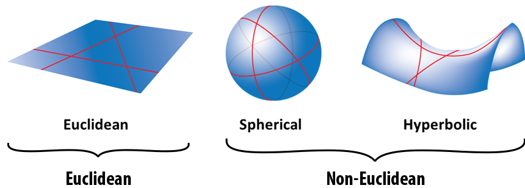

# Palace

Palace, probably should have been called the playground, because thats essentially what this site, and project is. I just wanna learn, and if i can make something that helps people in the process, that would be awesome.

### The Octogon

The Octogon, is a simple planter, for 4 plants. The design, is small and desktoppable. There are four quadrants, for water, so its basically self watering. At least for awhile. 

[Thingiverse](https://www.thingiverse.com)
___

Picture demonstrating difference between euclidean and non-euclidean geometry.
### Plannning for the following week

This week i would like to work on and do:

- [ ] Read my new book
- [ ] Follow the T.O.P program
- [ ] Work on LetsBuild(Hopefully it goes well)
- [ ] Find ideas for new project i can work on.
- [ ] Research the most important subjects, in our century.

### BOOKS
These books, are not ones i have read, but some i would like to and intend to read.
- Clean Code
- No Exit
- All things shining
- Anti-Education
- Quantum Computing
- Everything is Fucked
- Beyond good and evil

22/11/2021
___
